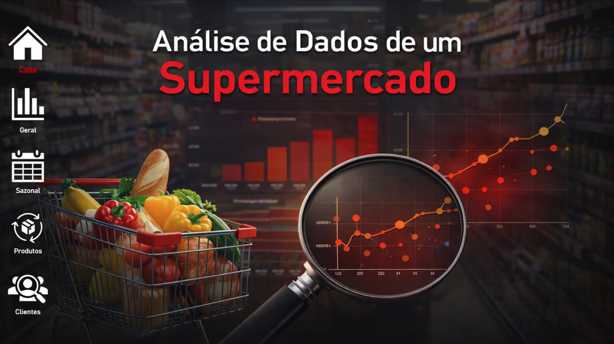
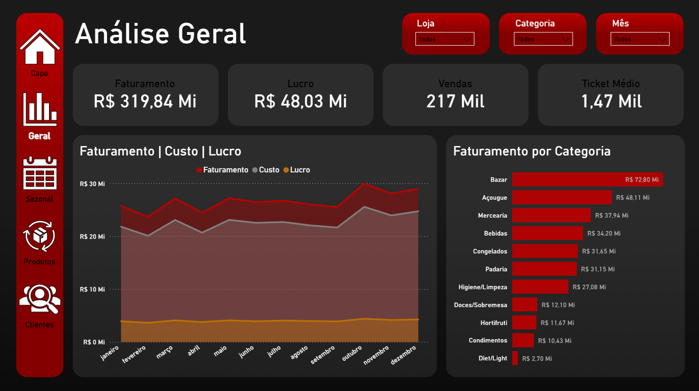
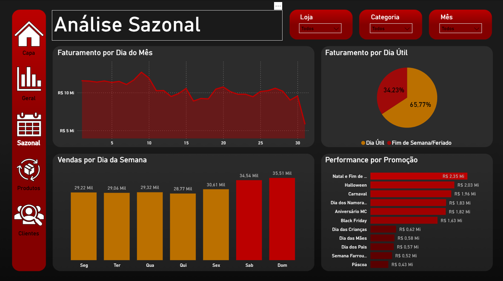
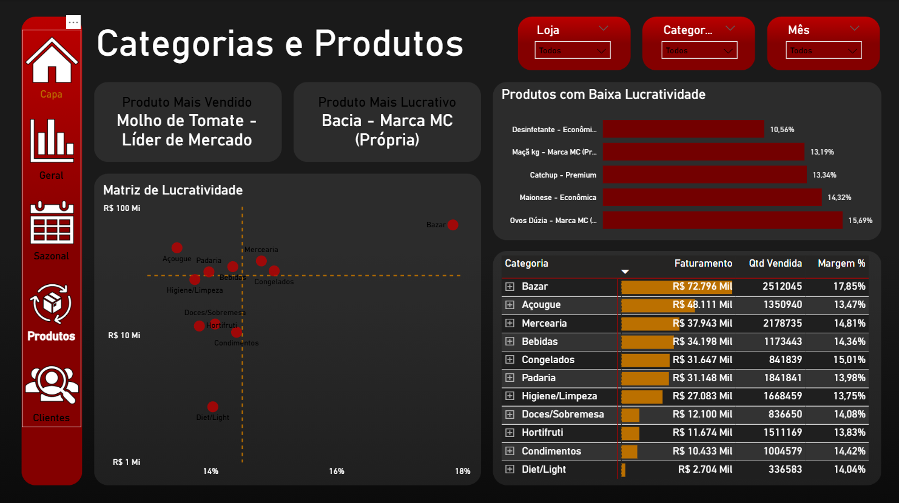
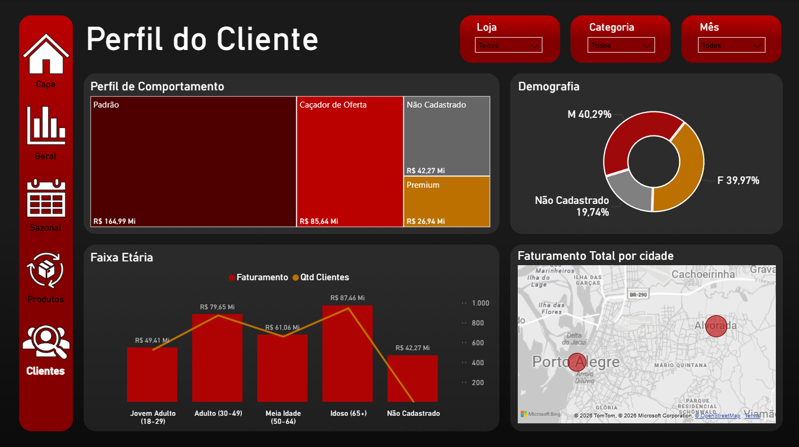

# 🛒 Supermarket Analytics Engineering: Pipeline End-to-End


> Um projeto completo de dados: da geração de dados massivos com Python à modelagem Star Schema no SQL e visualização executiva no Power BI.

---

## 📌 Visão Geral

Este projeto simula o ecossistema de dados real da rede fictícia "MC Supermercados".
O objetivo foi construir um **Data Warehouse** do zero para responder a perguntas críticas de negócio.

## 🏗️ Arquitetura do Projeto

**Fluxo de Dados:**
`Geração de Dados (Python)` ➔ `ETL & Tratamento` ➔ `Data Warehouse (SQL Server)` ➔ `Analytics (Power BI & DAX)`

* **Volume de Dados:** +2.4 Milhões de registros de vendas gerados.
* **Modelagem:** Star Schema (Esquema Estrela) otimizado para leitura.
* **Período:** Dados transacionais simulando o ano fiscal completo de 2025.

---

## 📊 Dashboard & Business Intelligence

A camada de visualização foi construída com foco em UX (Experiência do Usuário) e Storytelling.
*Nota: O arquivo editável (.pbix) não está disponível neste repositório, apenas as visualizações estáticas abaixo.*

### 🎥 Demonstração Completa
> Para ver as interações, tooltips e navegação dinâmica em funcionamento, assista ao vídeo de apresentação:

[](INSIRA_SEU_LINK_DO_LINKEDIN_AQUI)

### Galeria de Telas

**1. Menu Principal & Navegação**
*Interface estilo aplicativo com menu lateral retrátil.*


**2. Visão Geral (Executivo)**
*KPIs macroeconômicos: Faturamento, Lucro Líquido e Ticket Médio.*


**3. Análise Sazonal**
*Vendas por dia da semana, feriados e picos mensais.*


**4. Performance de Produtos**
*Matriz de Lucratividade, Pareto e Drill-through de Fornecedores.*


**5. Perfil do Cliente**
*Segmentação comportamenta (Caçadores de Oferta vs Premium).*


---

## 🛠️ Tecnologias & Engenharia

### 1. Python (Ingestão & Geração)
* **Bibliotecas:** `Pandas`, `Numpy`, `Faker`.
* **Diferencial:** Script complexo que gera **sazonalidade realista** (picos de venda no Natal/Black Friday) e introduz "dados sujos" propositais (vendas sem cadastro) para testar a robustez do tratamento de dados.

### 2. SQL Server (Armazenamento & Performance)
* **Modelagem Dimensional:** Conversão de dados transacionais para Fato (`fato_vendas`) e Dimensões (`dim_produtos`, `dim_clientes`, `dim_lojas`, etc.).
* **Performance Tuning:**
    * Criação de **Cluster Indexes** nas chaves primárias.
    * Uso de **Non-Clustered Indexes** em colunas de alta cardinalidade (`id_loja`, `data_venda`) para acelerar o consumo pelo Power BI.
* **SQL Avançado:** Uso de Window Functions (`LAG`, `RANK`) e CTEs para análises de crescimento (MoM).

---

## 📂 Estrutura do Repositório

```text
SupermarketAnalyticsEngineering/
│
├── 📁 src/                  # Scripts de Engenharia
│   ├── gerador_dados.py     # Script Python (Geração de massa e regras de negócio)
│   └── query_modelagem.sql  # DDL das tabelas e Views
│
├── 📁 dashboard/            # Visualização (Prints)
│   ├── 1.Capa.png
│   ├── 2.Analise_Geral.png
│   ├── 3.Analise_Sazonal.png
│   ├── 4.Categorias_Produtos.png
│   └── 5.Perfil_Cliente.png
│
├── 📁 sql/                  # Queries Analíticas (Validação)
│   ├── analise_avancada/    # Scripts de Churn, RFM e MoM
│   └── queries_validacao.sql
│
└── README.md                # Documentação do Projeto
```
---
*Desenvolvido por Jessica Curtinaz como projeto de portfólio de Engenharia e Análise de Dados.*
